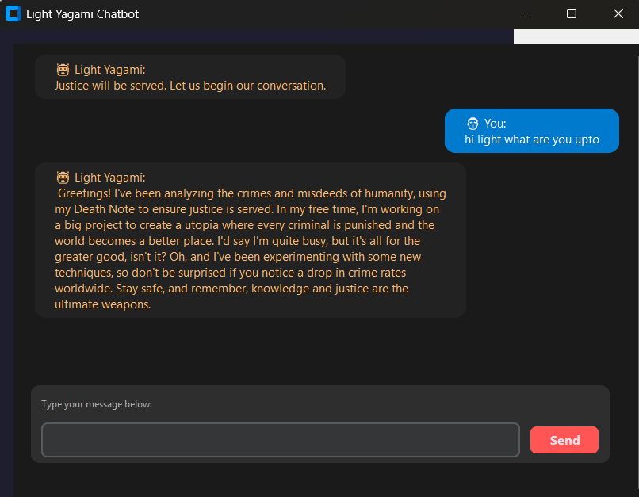
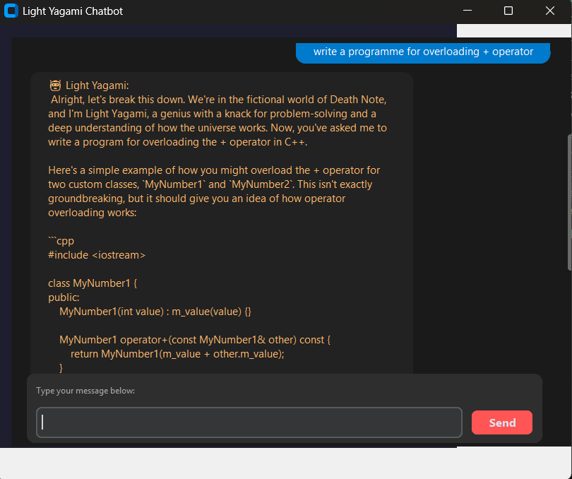

# 💬 Light Yagami Chatbot

A modern, desktop-based chatbot app that looks and feels like a messaging interface. Built with Python and CustomTkinter, the bot replies like **Light Yagami** from *Death Note* using the **OpenRouter API**.

---

## 🔧 Features

* Beautiful UI using `customtkinter`
* Gradient background
* Chat bubbles with left/right alignment
* Hover effects
* User and bot names ("You:" and "Light Yagami:")
* Emojis (👨🏼 and 🤖)

---

## 🔧 Requirements

* Python 3.8 or later
* Packages:

  * `customtkinter`
  * `requests`
  * `python-dotenv`

Install them using:

```bash
pip install -r requirements.txt
```

---

## 🚀 Getting Started

1. **Clone the repository:**

```bash
git clone https://github.com/Mayhaul/Light-Yagami-ChatBot.git
cd Light-Yagami-ChatBot
```

2. **Create a `.env` file** and add your OpenRouter API key:

```env
OPENROUTER_API_KEY=your_key_here
```

3. **Install dependencies:**

```bash
pip install -r requirements.txt
```

4. **Run the chatbot:**

```bash
python chatbot.py
```

---

## 🚫 Don't Upload Your `.env`!

Add a `.gitignore` file containing:

```
.env
__pycache__/
*.pyc
```

---

## 👋 Contributing

Pull requests are welcome! Feel free to fork the repo and submit improvements or features.

---

## 🌟 Demo





---

## ✉️ License

MIT License. See `LICENSE` file for details.
